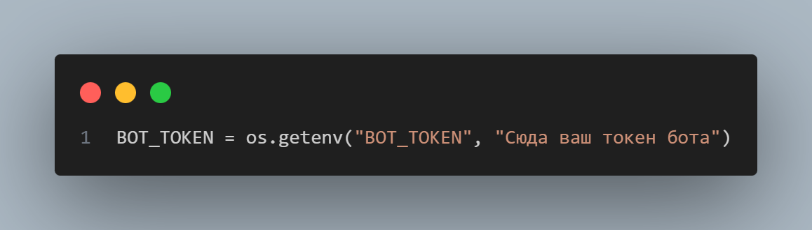

# 🎭 Telegram Emoji Downloader

<div align="center">
  
  
  <br/>
  
  
  
  
  
  **Скачивай Telegram Premium эмодзи в PNG одним сообщением** 🚀
</div>

---

## ✨ Что умеет бот

| Функция | Описание |
|--------|----------|
| 🔗 **По ссылке** | Скачать целый набор по `t.me/addemoji/SetName` |
| 🔢 **По ID** | Скачать одно эмодзи по числовому ID |
| 📦 **ZIP архив** | Весь набор упаковывается в `.zip` с PNG файлами |
| 🎞️ **Анимации** | Конвертация `.tgs` (Lottie) → PNG через `rlottie-python` |
| 🎬 **Видео стикеры** | Конвертация `.webm` → PNG через `ffmpeg` |
| 🖼️ **Статичные** | Конвертация `.webp` → PNG через `Pillow` |

---

## 🚀 Установка и запуск

### 1. Клонируй репозиторий

```bash
git clone https://github.com/your-username/telegram-emoji-downloader.git
cd telegram-emoji-downloader
```

### 2. Установи зависимости

```bash
pip install aiogram aiohttp aiofiles pillow rlottie-python
```

> **ffmpeg** нужен для видео-стикеров. Установи отдельно:
> - **Windows**: [ffmpeg.org/download.html](https://ffmpeg.org/download.html)
> - **Linux**: `sudo apt install ffmpeg`
> - **macOS**: `brew install ffmpeg`

### 3. Вставь токен бота

Открой `bot.py` и замени токен на строке 20:



```python
BOT_TOKEN = os.getenv("BOT_TOKEN", "Сюда ваш токен бота")  # ← вставь сюда
```

> 💡 Получить токен можно у [@BotFather](https://t.me/BotFather) в Telegram.

Или задай через переменную окружения:

```bash
export BOT_TOKEN="ваш_токен_здесь"
```

### 4. Запусти бота

```bash
python bot.py
```

---

## 📦 Зависимости

```txt
aiogram>=3.0
aiohttp
aiofiles
Pillow
rlottie-python
```

---

## 💬 Как использовать

1. Найди набор эмодзи в Telegram
2. Скопируй ссылку вида `https://t.me/addemoji/SetName`
3. Отправь боту — получи ZIP с PNG 🎉

---

## 🛠️ Сделано с помощью

- [aiogram](https://github.com/aiogram/aiogram) — асинхронный фреймворк для Telegram Bot API
- [rlottie-python](https://github.com/laggykiller/rlottie-python) — рендер Lottie анимаций
- [Pillow](https://python-pillow.org/) — обработка изображений
- [ffmpeg](https://ffmpeg.org/) — конвертация видео

---

<div align="center">
  Made with ❤️ by <b>ClaudeAI</b>
</div>
